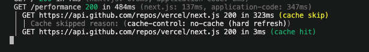
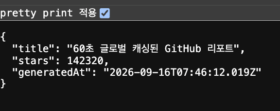

# [CS 아키텍처] 메모이제이션(Memoization)과 HTTP 캐시 제어

실제 서비스 운영 환경에서 서버 과부하를 막고 응답 속도를 높이기 위한 두 가지 핵심 최적화 기법(메모이제이션, HTTP 캐시)을 다룹니다.

## 1. 짧은 기억의 마법: 메모이제이션 (Memoization)

- **개념**: 동일한 계산을 반복해야 할 때, 이전에 계산한 결과값을 메모리에 저장(포스트잇 개념)해 두었다가 동일한 요청이 오면 연산을 생략하고 즉시 반환하는 최적화 기법입니다.
- **작동 원리 (콘솔 테스트 흐름)**:
- **Cache Miss**: 캐시에 데이터가 없으면 무거운 연산(DB 조회 등)을 수행하고 결과를 메모리에 저장합니다.
- **Cache Hit**: 캐시에 데이터가 존재하면 연산 과정을 통째로 건너뛰고 즉시 값을 반환하여 속도를 극대화합니다.

- **한계점**: Next.js의 요청 메모이제이션 등은 **하나의 페이지 렌더링 사이클 내에서만 유효**하며, 렌더링이 끝나면 데이터가 사라집니다.

```javascript
/**
 * 메모이제이션의 아키텍처 원리를 보여주는 개념적 코드 및 테스트
 */
const memoCache: Record<string, any> = {}; // 시스템의 임시 메모리 (포스트잇)

function expensiveCalculation(input: string): string {
  // [Step 1] 캐시 히트(Cache Hit) 검증
  if (memoCache[input]) {
    console.log(`🟢 [Cache Hit] '${input}'에 대한 캐시된 정답을 메모리에서 발견! 즉시 반환합니다.`);
    return memoCache[input]; // 무거운 연산 과정을 통째로 건너뜀
  }

  // [Step 2] 캐시 미스(Cache Miss) 처리 및 무거운 연산 수행
  console.log(`🔴 [Cache Miss] '${input}' 데이터가 없습니다. 데이터베이스를 조회하여 새롭게 연산 중입니다...`);
  const result = `결과값: ${input} 처리 완료`;

  // [Step 3] 연산 결과의 메모리 적재
  memoCache[input] = result; // 다음 요청을 방어하기 위해 포스트잇에 기록

  return result;
}

// 🚀 [실전 테스트 코드] 콘솔에서 직접 실행해 보세요!
console.log("=== 시스템 렌더링 시작 ===");
console.log(expensiveCalculation("user_123")); // Call 1
console.log(expensiveCalculation("user_123")); // Call 2
console.log(expensiveCalculation("user_999")); // Call 3
console.log("=== 시스템 렌더링 종료 ===");


```

## 2. 거대한 글로벌 기억 장치: HTTP 캐시와 CDN

- **핵심 용어**:
- **프록시 (Proxy)**: 클라이언트와 서버 사이를 중계하며 요청을 처리하는 중간 서버 (홀 매니저 역할)
- **CDN**: 전 세계 곳곳에 프록시 서버를 구축해 사용자가 가까운 곳에서 데이터를 빠르게 받아볼 수 있게 하는 네트워크

- **Cache-Control 헤더 활용 (`s-maxage`, `stale-while-revalidate`)**:
- **유통기한 (`s-maxage=60`)**: 지정된 시간 동안 CDN 금고에 데이터를 보관하며 원본 서버 조회 없이 빠르게 응답합니다.
- **유예 기간 (`stale-while-revalidate=30`)**: 유통기한이 지나도 유예 시간 동안은 기존 데이터(Stale)를 먼저 즉시 보여주고, 백그라운드에서 몰래 새로운 데이터를 갱신(Revalidate)합니다. 사용자에게 로딩 없는 매끄러운 경험을 제공합니다.

```javascript
/**
 * Route Handler에서 HTTP Cache-Control 헤더를 제어하는 실무 아키텍처
 */
export async function GET() {
  const data = { message: "이 데이터는 완벽하게 통제된 캐시 정책을 따릅니다." };

  return Response.json(data, {
    headers: {
      "Cache-Control": "s-maxage=60, stale-while-revalidate=30",
    },
  });
}
```

## 3. Next.js 15 파괴적 변화 (Breaking Change)

- **과거 (v14 이전)**: 프레임워크가 기본적으로 모든 데이터를 공격적으로 자동 캐싱
- **현재 (v15 이후)**: `fetch` 요청이나 API 라우트가 **기본적으로 캐싱을 하지 않는(`no-store`) 상태**로 변경
- **시사점**: 이제 프레임워크에 의존하지 않고, 아키텍트가 직접 시스템 부하를 판단하여 명시적인 캐시 제어 지침(`Cache-Control`)을 내려야 하는 '진정한 통제의 시대'가 되었습니다.

  **요약**: 컴포넌트 내부의 연산 중복을 잡는 것은 **메모이제이션**, 글로벌 네트워크 트래픽과 서버 본체를 보호하는 것은 **HTTP 캐시 제어**가 담당합니다.

# Next.js 15 캐싱과 요청 메모이제이션

## 1. 프로젝트 환경 세팅 (`next.config.ts`)

- **서버 네트워크 엑스레이 켜기**: `logging.fetches: { fullUrl: true }` 설정을 통해 서버에서 발생하는 네트워크 통신과 캐시 상태(HIT/MISS)를 터미널로 투명하게 모니터링합니다.

```javascript
import type { NextConfig } from "next";

const nextConfig: NextConfig = {
  /* config options here */
  reactCompiler: true,
  logging: {
    fetches: {
      fullUrl: true,
    },
  },
};

export default nextConfig;

```

## 2. Request Memoization 검증 (`/performance`)

- **중복 요청 자동 차단**: 서버 컴포넌트 렌더링 주기가 한 번 돌 때 동일한 `fetch` 요청이 여러 번 발생하더라도, 프레임워크가 이를 감지하여 **실제 네트워크 통신은 단 1회만 수행**하고 메모리에서 값을 재사용합니다.

```javascript
/**
 * 1. 실제 GitHub API를 호출하는 코어 함수
 */
async function getNextjsStats() {
  // 브라우저 표준 fetch API에 Next.js만의 특수 통제 객체인 'next' 속성을 주입합니다.
  const res = await fetch("<https://api.github.com/repos/vercel/next.js>", {
    next: { revalidate: 3600 },
  });

  if (!res.ok) throw new Error("GitHub 데이터를 가져오는데 실패했습니다.");
  return res.json();
}

/**
 * 2. 서버 컴포넌트 실습
 * 시스템 내부의 Request Memoization 작동을 증명하기 위해 의도적으로 함수를 두 번 호출합니다.
 */
export default async function PerformancePage() {
  // 첫 번째 호출: 시스템 메모리가 비어있으므로 실제 네트워크 통신이 발생합니다.
  const data1 = await getNextjsStats();

  // 두 번째 호출: 동일한 fetch 요청을 감지한 시스템이 네트워크 통신을 차단하고 메모리에서 값을 꺼냅니다.
  const data2 = await getNextjsStats();

  return (
    <main style={{ padding: "40px" }}>
      <h1 style={{ color: "#f59e0b" }}>Request Memoization 통제 완료</h1>
      <hr style={{ borderColor: "#1e293b", margin: "20px 0" }} />
      <p>
        <strong>Repository:</strong> {data1.full_name}
      </p>
      <p>
        <strong>Stars:</strong> {data1.stargazers_count.toLocaleString()}
      </p>
      <p>
        <strong>isIdentical:</strong> {String(data1.id === data2.id)}
      </p>
    </main>
  );
}
```

```javascript
next: {
  revalidate: 3600;
}
```

이 코드는 **Next.js가 브라우저 표준 `fetch` API를 확장하여 만든 특수 캐시 제어 옵션**입니다.

세부적인 의미는 다음과 같습니다:

- **`revalidate`**: 데이터의 유효 기간(시간)을 의미합니다.
- **`3600`**: 단위를 초(Second)로 나타내며, 3600초 즉 **1시간**을 뜻합니다.

### 동작 원리

1. 이 옵션이 포함된 `fetch` 요청을 보내면, Next.js는 응답 데이터를 서버의 데이터 캐시(Data Cache)에 저장합니다.
2. 이후 1시간(3600초) 동안 동일한 데이터 요청이 들어오면, **실제 외부 API(GitHub)로 네트워크 요청을 보내지 않고** 캐시된 데이터를 곧바로 반환합니다.
3. 1시간이 지난 뒤에 요청이 들어오면, 백그라운드에서 새로운 데이터를 받아와 캐시를 갱신합니다.

Next.js 15부터는 기본적으로 데이터 캐싱이 꺼져 있는(Dynamic Rendering) 경우가 많기 때문에, 개발자가 직접 이 옵션을 주어 특정 데이터의 캐싱 주기를 통제할 때 사용합니다.

## 3. Segment Config 캐시 방어막 구축 (`/api/static-github/route.ts`)

- **라우트 전체 캐싱**: 파일 상단에 `export const revalidate = 60`을 선언하여, 별도의 복잡한 헤더 조작 없이 해당 라우트의 결과물을 서버 캐시에 **60초 동안 강제 고정**합니다.
- **과부하 방지**: Next.js 15의 기본값인 동적 렌더링 환경에서 수많은 접속자로 인한 데이터베이스 및 서버 부하를 효과적으로 방어합니다.

### 배경: 일반적인 캐싱 방식 (`fetch` 옵션)

Next.js에서 데이터를 캐싱할 때는 보통 앞서 보았던 것처럼 `fetch` 함수 내부에 옵션을 붙입니다.

```typescript
const res = await fetch("...", { next: { revalidate: 60 } });
```

하지만 실무 개발을 하다 보면 직접 `fetch` API를 쓰지 못하는 상황이 생깁니다.

### "ORM이나 외부 SDK를 사용하여 fetch 옵션을 쓸 수 없을 때"의 의미

실무에서는 백엔드 데이터베이스나 외부 서비스와 통신할 때 직접 `fetch`를 호출하기보다, 라이브러리(도구)를 거쳐서 데이터를 가져오는 경우가 많습니다.

- **ORM (예: Prisma)**: 데이터베이스(PostgreSQL, MySQL 등)와 소통할 때 쓰는 도구입니다. `prisma.user.findMany()` 같은 자체 메서드를 사용하므로, 우리가 `fetch` 함수를 쓸 수 없고 그 안에 `next: { revalidate: 60 }` 같은 옵션을 넣을 수도 없습니다.
- **외부 SDK**: AWS SDK, Firebase SDK, Stripe(결제) SDK 등 서드파티 서비스의 공식 라이브러리를 쓸 때도 마찬가지입니다. 내부적으로 알아서 통신하기 때문에 우리가 직접 `fetch` 옵션을 조작할 수 없습니다.

즉, "내가 직접 `fetch`를 안 쓰니까 개별 `fetch`에 캐시를 걸 수가 없네?"라는 상황이 발생하는 것입니다.

### 해결책: 파일 통째로 캐시 방어막 치기 (`export const revalidate = 60`)

```javascript
// 실무에서 ORM(Prisma)이나 외부 SDK를 사용하여 fetch 옵션을 쓸 수 없을 때, 파일 통째로 캐시 방어막을 치는 방법입니다.

import { NextResponse } from "next/server";

export const revalidate = 60;

export async function GET() {
  const res = await fetch("https://api.github.com/repos/vercel/next.js");
  const data = await res.json();
  return NextResponse.json({
    title: "60초 글로벌 캐싱된 GitHub 리포트",
    stars: data.stargazers_count,
    generatedAt: new Date().toISOString(),
  });
}
```

이때 등장하는 구원투수가 바로 **Segment Config**인 `export const revalidate = 60;`입니다.

- 코드가 내부적으로 Prisma를 쓰든, 복잡한 SDK를 쓰든 상관없이 "이 API 파일(세그먼트) 안에서 일어나는 모든 연산의 최종 결과물"을 통째로 60초 동안 서버 캐시에 묶어버립니다.
- 즉, 개별 함수마다 캐시를 설정할 필요 없이 파일 맨 위에 한 줄만 적어두면, 그 안의 모든 데이터베이스 조회나 연산이 한꺼번에 보호받는 **거대한 캐시 방어막**이 쳐지는 것입니다.

### 요약

> _"데이터를 가져오는 방식이 복잡해서 `fetch` 옵션을 직접 못 쓰더라도, 파일 맨 위에 `revalidate` 한 줄만 적어두면 그 파일의 최종 응답 전체를 캐싱해서 서버 부하를 막을 수 있다"_ 라는 뜻입니다.

## 4. 운영 환경(Production) 빌드 검증의 중요성

- **개발 모드(`npm run dev`)**: 실시간 반영을 위해 캐시 엔진을 느슨하게 풀어놓으므로 캐시 테스트가 정확하지 않습니다.
- **운영 모드(`npm run build` 후 `npm start`)**: 반드시 프로덕션 빌드 환경에서 실행해야 캐시 HIT 및 `revalidate` 방어막이 완벽하게 작동하는 것을 확인할 수 있습니다.

## 테스팅 결과

### 실습1

- 첫 번째 요청은 수십 밀리초(ms)가 걸리지만, 두 번째 로그는 처리 시간이 단 3ms이며 초록색으로 (cache hit)이 명확하게 찍혀 있을 것입니다. 프레임워크가 외부 네트워크 통신을 완벽히 차단한 것
  

### 실습2


